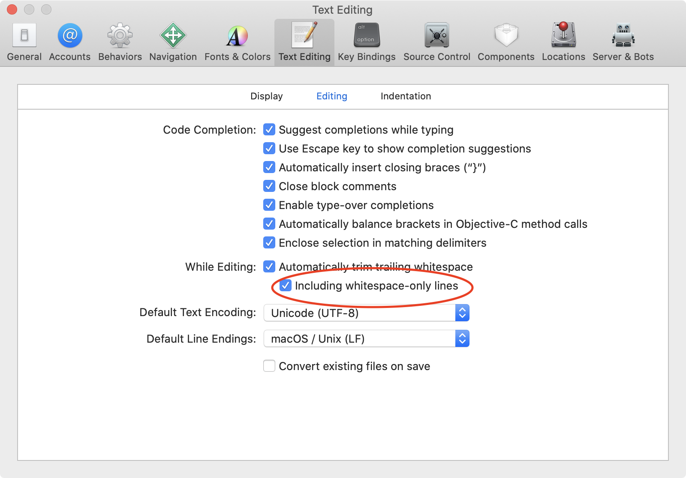

# Swift Style Guide

The SwiftLint configuration on this repo is based on the great work of the raywenderlich.com folks [The Official raywenderlich.com Swift Style Guide](https://github.com/raywenderlich/swift-style-guide).

The purpose of this guide is to provide a base format for our Swift codebase. This guide describes what are the rules enforced by our swift lint rules and should beused when contributing or reviewing code. 

These guides use SwiftLint as a standard. You can learn more about SwiftLint by visiting its [official documentation page](https://github.com/realm/SwiftLint).

## Table of Contents

* [Installing SwiftLint](#installing-swiftlint)
* [Using the configuration file](#using-the-configuration-file)
* [Xcode settings](#xcode-settings)
* [Running SwiftLint](#running-swiftlint)
* [Handling rule exceptions](#handling-rule-exceptions)
* [Approved exceptions](#approved-exceptions)
	* [Implicitly unwrapped optionals](#implicitly-unwrapped-optionals)
	* [Force cast](#force-cast)
	* [Force unwrapping](#force-unwrapping)
	* [SwiftUI and multiple trailing closures](#swiftui-and-multiple-trailing-closures)
	* [Open-source files](#open-source-files)
* [Other notes](#other-notes)

## Installing SwiftLint


```bash
brew install swiftlint
```

If you are unable to use Homebrew, you may use one of the other methods described in the [SwiftLint documentation](https://github.com/realm/SwiftLint).

**Do not** install SwiftLint as a CocoaPod in your project.


## Xcode settings

You'll need to configure Xcode to remove trailing whitespace from all lines. This is not the default configuration.

In Xcode's Preferences, select **Text Editing** ▸ **Editing** and check **Including whitespace-only lines**. 



## Handling rule exceptions

Your sample project must compile without warnings — SwiftLint or otherwise. In general, you should change your code to eliminate all warnings where necessary. When it comes to SwiftLint, however, there will be times when this isn't possible. In these situations, you'll need to use in-line comments to temporarily disable rules. You can find appropriate syntax to do this in [the SwiftLint documentation](https://realm.github.io/SwiftLint/#disable-rules-in-code).

You may only disable a rule if it is on the list of approved exceptions listed below.

Prefer the form that disables a rule only for the next line:
```
// swiftlint:disable:next implicitly_unwrapped_optional
var injectedValue: Data!
```

Or, similarly, for the previous line:
```
var injectedValue: Data!
// swiftlint:disable:previous implicitly_unwrapped_optional
```

If there are several approved exceptions, group them together and disable the rule for that region. Be sure to enable the rule after that section. Do not leave a rule disabled throughout the source file.

```
// swiftlint:disable implicitly_unwrapped_optional
var injectedValue1: Data!
var injectedValue2: Data!
// swiftlint:enable implicitly_unwrapped_optional
```

If you must disable rules in your project, leave those in-line comments in the project for the benefit of your teammates in the editing pipeline.

Finally, if you're not sure which rule is triggering a warning, you can find the rule name in parentheses at the end of message:


## Approved exceptions

There are certain common idioms that violate SwiftLint's strict checking. If you are unable to work around them — and you've already tried to find a better way to structure your code — you may disable rules as described in this section.

If you find that you're struggling with rules other than those described below, please reach out to your Team Lead with your specific example.

### Implicitly unwrapped optionals

It is sometimes common, in lieu of using dependency injection, to declare a child view controller's properties as implicitly unwrapped optionals (IUO). If you're unable to structure your project to avoid this, you may disable the `implicitly_unwrapped_optional` rule for those dependency declarations. With the advent of `@IBSegueAction`, this should be rare.

### Force cast

You may use force casting — and disable the `force_cast` rule — in the `UITableViewDataSource` and `UICollectionViewDataSource` methods that dequeue cells.

### Force unwrapping

You may use forced unwrapping — rule name `force_unwrap` — when returning a color from an asset catalog:

```
static var rwGreen: UIColor {
  // swiftlint:disable:next force_unwrapping
  UIColor(named: "rw-green")!
}
```

You may also use it in the same context as the force cast exception above, dequeuing cells in `UITableViewDataSource` and `UICollectionViewDataSource` methods.

Although it's preferred that you model appropriately defensive code for our readers, you may use force unwrapping to access resources that you _know_ are included in the app bundle.

Finally, you may use force unwrapping when constructing a `URL` from a hard-coded, and guaranteed valid, URL string.

### SwiftUI and multiple trailing closures

Idiomatic SwiftUI uses trailing closures to provide the view content for certain user interface elements. `Button` is a prime example; it has an initializer form that uses a closure to provide its `label`. It's common to write something like the following:

```
Button(action: { self.isPresented.toggle() }) {
  Image(systemName: "plus")
}
```

This violates the rule that you should not use trailing closure syntax when a method accepts multiple closure parameters, so SwiftLint will flag it with a warning. 

You can work around this by extracting the `Button`'s action into a separate method. While this is frequently a better solution when the action requires several statements, it's an onerous requirement when the action is a single statement, as in the example above.

In these cases, you're permitted to disable this rule **for the declaration of a SwiftUI view** only. The rule name is `multiple_closures_with_trailing_closure`.

### Open-source files

Occasionally, you'll find it necessary to include an unmodified open-source file in the sample project. It's a virtual certainty that these files won't comply with our style guide. Our practice has always been to leave these files in their original state. In this situation, you should disable SwiftLint for the entire file:

```
// swiftlint:disable all
```

## Other notes

While SwiftLint goes a long way towards making your source code compliant with our style guide, it doesn't cover everything. For example, it won't catch or force you to correct the formatting for multi-condition `guard` statements. If you find yourself butting heads with SwiftLint, or have improvement suggestions, please file an Issue and send a PR request with your suggestions.